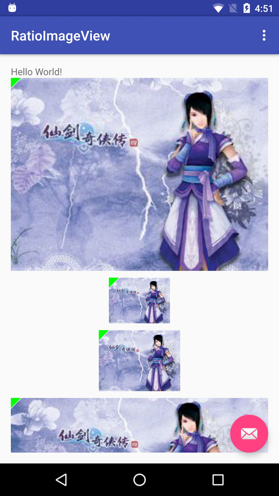

# RatioImageView
能够设定宽高比例的`ImageView`
这个`ImageView`是写来自己用的,避免了每次加载图片时都需要计算宽高并设置`LayoutParams`的麻烦

用法如下:
```xml
<com.foolchen.library.riv.RatioImageView
    android:id="@+id/riv_1"
    android:layout_width="match_parent"
    android:layout_height="wrap_content"
    android:scaleType="centerCrop"
    android:src="@mipmap/ic_launcher"
    app:horizontal_weight="4"
    app:vertical_weight="3"
    app:base="horizontal" />

<com.foolchen.library.riv.RatioImageView
    android:id="@+id/riv_2"
    android:layout_width="90dp"
    android:layout_height="wrap_content"
    android:scaleType="centerCrop"
    android:src="@mipmap/ic_launcher"
    app:horizontal_weight="4"
    app:vertical_weight="3"
    app:base="horizontal"
    android:layout_marginTop="10dp" />

<com.foolchen.library.riv.RatioImageView
    android:id="@+id/riv_3"
    android:layout_width="wrap_content"
    android:layout_height="90dp"
    android:scaleType="centerCrop"
    android:src="@mipmap/ic_launcher"
    app:horizontal_weight="4"
    app:vertical_weight="3"
    app:base="vertical"
    android:layout_marginTop="10dp" />

<com.foolchen.library.riv.RatioImageView
    android:id="@+id/riv_4"
    android:layout_width="match_parent"
    android:layout_height="wrap_content"
    android:scaleType="centerCrop"
    android:src="@mipmap/ic_launcher"
    app:horizontal_weight="16"
    app:vertical_weight="9"
    app:base="horizontal"
    android:layout_marginTop="10dp" />
```

也提供了`setWidth(int)`和`setHeight(int)`方法,用于动态设定宽高.

**注意:在调用`setWidth(int)`设定宽度时,`ImageView`会直接以宽度为基准进行比例的调整,不需要再设定高度;调用`setHeight(int)`时同理.**


